# A Measure-First Probabilistic Engine for Football Prediction

*AI World Cup 2026 Predictor — a research testbed for football-prediction
algorithms (academic; not a betting product).*

**Authors:** Kien Tran · Claude Code

## Abstract

We describe the prediction methodology of an open World-Cup-2026 forecasting
system. All match targets — match result (1X2), exact score, Asian handicap and
Over/Under (goals and corners) — are read from **one reconciled bivariate goal
distribution**, so they are mutually consistent by construction. Team strength
is an ML ensemble (RPS 0.1605 on a 1,313-match hold-out); on top of it sit a set
of **bounded factor priors** whose *direction* is taken from literature but whose
*magnitude* is either fitted from data or held small and audited live. We adopt
a single discipline — **measure first: a factor is wired in only if it beats a
strength baseline on a hold-out; otherwise it is shrunk, dropped, or recorded as
a null result.** Following it we (i) fitted corner coefficients from 314–5,232
StatsBomb matches, (ii) calibrated Over/Under, (iii) estimated the causal
score-state effect with a strength-controlled GLM, (iv) blended Dixon-Coles
attack/defence ratings into the goal rate, and (v) added an xG-based
in-tournament rating update — while explicitly *rejecting* rest/fatigue, graph
embeddings, tactical counter-matchups and player-style features that did not
beat the baseline. Every coefficient lives in a JSON artifact read at serving
time and is graded by live scorecards.

**Guiding rule.** *Don't assume a coefficient if it can be measured; if it
can't be measured cleanly, keep it small, bounded, and audited live.*

---

## 1. Introduction

Football outcomes are strength-dominated and high-variance, which sets a low
ceiling on predictability and a high bar for any new feature. The system is
built so that (a) every user-facing market derives from a single coherent
distribution, and (b) every modelling choice is testable and reversible. This
document records each factor, the experiment behind it, and — importantly —
which appealing ideas were *refuted* by the data.

---

## 2. Data

| Source | Role | Notes |
|---|---|---|
| football-data.org v4 | fixtures, standings, results | free tier; no venue/minute |
| LiveScore (unofficial) | live minute, score, incidents, stats, shot map | possession, shots, crosses, corners |
| **StatsBomb open data** | event-level (passes, shots, xG, pressures) | basis for all corner/style/sim/att-def fits |
| eloratings.net | World Football Elo | live + static snapshot |
| ClubElo | club strength | squad-strength prior |
| martj42/international_results | 49k internationals | ensemble + Dixon-Coles training |
| football-data.co.uk | 9k club matches (corners/shots/odds) | corners dispersion, ensemble |
| The Odds API | bookmaker h2h/totals/spreads | market comparison / value |

The StatsBomb **men's** event corpus used for fits spans WC 2018/2022,
Euro 2020/2024, Copa América 2024, AFCON 2023 and full club seasons
(PL/La Liga/Ligue 1/Serie A 2015-16, Bundesliga, La Liga 2004-21, …) —
**5,232 team-match rows** (628 international, 4,604 club).

---

## 3. Methodology and algorithms

This section gives the scientific basis of each core component — the
probabilistic scoring model, the strength model, the ML ensemble, the
consistency projection and the Monte-Carlo simulator — with numbered equations
and illustrative pseudocode. Symbols are defined in Appendix B. (Equations
render on GitHub.)

### 3.1 Pipeline overview

Everything converges on a per-team expected-goals rate λ; one score
matrix is built from (λ_h, λ_a), reconciled to the headline
marginals, and every market is read off it. The minute simulator runs in
parallel for scenario timing.

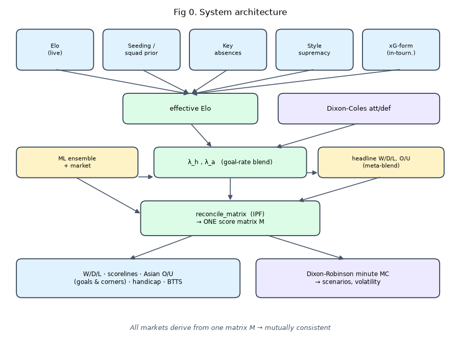

### 3.2 Probabilistic scoring model — bivariate Poisson with Dixon-Coles

**Theory.** Goals arrive approximately as a *Poisson process*, so a team's goal
count in a match is Poisson with mean λ:

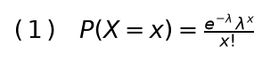

A match is two teams, so the baseline is a product of two independent Poissons.
Empirically that **under-predicts draws** (0-0, 1-1). **Dixon & Coles (1997)**
[1] correct exactly those low-score cells with a dependence factor
τ controlled by ρ (we fit ρ≈−0.06):

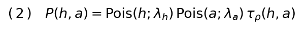

**Strength parameterization (Maher 1982 [2]; Dixon-Coles [1]).** Each team gets
an attack α and a defence β; the rate is log-linear, fit by
maximum likelihood with exponential **time-decay** on 49k internationals:

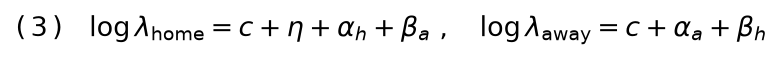

(η = home advantage). This separates a great-attack/weak-defence team from
a balanced one of equal overall strength (§4.4).

### 3.3 Team strength → goal rate

**Elo** [3] updates a rating toward the result, scaled by surprise; the win
expectation is logistic and the update proportional to the residual:

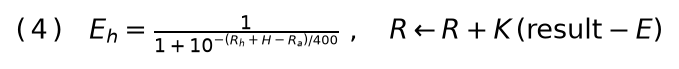

We map the Elo gap to a symmetric goal rate and **blend** it with the
asymmetric Dixon-Coles rate (Eq. 3):

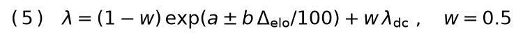

### 3.4 The ML ensemble (W/D/L and O/U heads)

Two complementary learners over pre-match features (Elo gap, pi-ratings [4],
rolling form, importance, neutral flag): a **multinomial logistic regression**
(linear, calibrated) and **gradient-boosted trees** (XGBoost [5], additive trees
fit to the loss gradient, capturing non-linear interactions). Tree outputs are
**isotonic-calibrated** [6], then convex-blended with weights minimising the
**Ranked Probability Score** [7] — the proper scoring rule for ordered W/D/L:

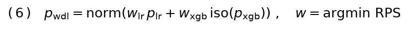

### 3.5 Reconciliation as a minimum-KL projection (IPF)

We want the single matrix M matching the blended headline marginals while
staying closest to the Dixon-Coles prior M₀. "Closest" in information geometry
is the **I-projection** — minimise KL divergence subject to the marginal
constraints (Csiszár 1975 [8]):

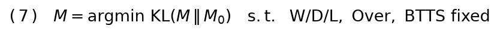

**Iterative Proportional Fitting** (Deming-Stephan 1940 [9]; Sinkhorn 1967 [10])
solves it by cyclically rescaling each constrained region to its target:

```
reconcile_matrix(M0, targets):
  M ← M0
  repeat until converged:
     for each constraint region S (e.g. {over},{under}):
        M[S] ← M[S] · target_S / mass(M[S])
     M ← M / sum(M)
  return M        # scorelines, O/U, handicap, BTTS all read from one M
```

### 3.6 Monte-Carlo match simulation (Dixon-Robinson, minute-by-minute)

The closed-form matrix gives the final-score law but no *timeline*. We simulate
an **inhomogeneous Poisson process** over 90 minutes (Dixon-Robinson 1998 [11])
with (i) a fitted per-minute intensity w(m), Σ w(m)=1; (ii) score-state
feedback (trailing team ↑, leader →, estimated causally, §3.8); (iii)
**parameter uncertainty** — each trial draws λ from a **Gamma** prior, so
the marginal count is **negative-binomial**, reproducing the observed
over-dispersion (§4.2):

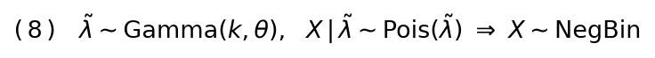

```
simulate(λ_h, λ_a, N):
  for trial in 1..N:
     λ̃ ← Gamma(mean=λ, cv=σ)                       # parameter uncertainty
     for minute m = 1..90:
        s ← state_multiplier(current_lead)          # trailing↑, leader→ (§3.8)
        Δg_h ~ Pois(λ̃_h·w(m)·s_h);  Δg_a ~ Pois(λ̃_a·w(m)·s_a)
     record final score + goal minutes
  return comeback%, late-goal%, result-flips-vs-HT (volatility), …
```

Validated equal to the matrix on W/D/L, so the headline stays from the matrix.

### 3.7 Bounded priors and Bayesian shrinkage

Seeding, squad-strength and xG-form are **Elo offsets** shrunk by evidence. The
n/(n+k) weight is the Bayesian posterior weight on n noisy observations
(precision-weighted mean); clipping bounds a thin sample:

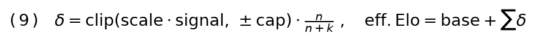

### 3.8 Strength-controlled causal estimation

Some effects are **confounded** (strong teams both lead and score). To recover
the causal within-match effect we fit a Poisson GLM with the team's own expected
rate as a fixed **offset**, identifying the coefficient net of quality:

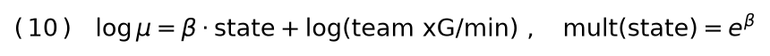

## 4. Experiments and results

All fits run offline (`backend/ml/*.py`) and write JSON artifacts read at serving
time, so re-running a script updates production with no code change.

### 4.1 Corner determinants

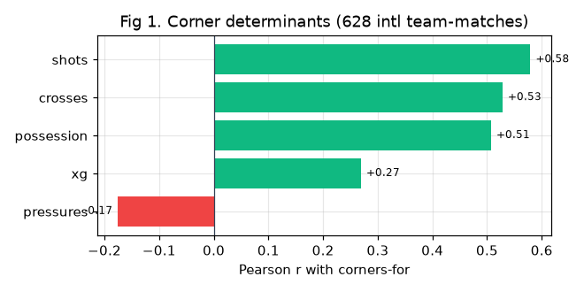

On 628 international team-matches, corners-for correlate with shots (r=0.58),
crosses (0.53), possession (0.51), xG (0.27) and — counter-intuitively —
**negatively with pressing** (−0.18). A Poisson GLM `corners ~ crosses +
possession + shots` is significant on all terms (p<0.01). **Fitted:**
crosses→corner ratio **0.389** (was a hand-set 0.28); base **9.07** corners/game
(was a club-leaning 9.67), then adaptively shrunk toward the observed WC-2026
mean. The old `high_press` and manager corner bumps were **dropped** (pressing
is negative). On the enriched 5,232-match set the intl coefficients are
confirmed (club runs higher: 0.429 / 10.06); **box entries** (passes into the
box) are the strongest corner signal (r=0.67) but are event-level and not
available live, so they inform — not serve — the model.

### 4.2 Goal distribution and Over/Under calibration

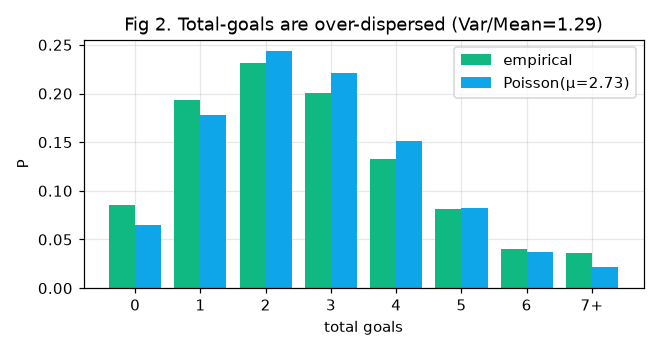
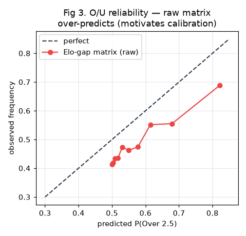

Total goals are **over-dispersed** vs a single Poisson (Var/Mean≈1.29, fatter
0–1 and 7+ tails). The raw Elo-gap matrix therefore **over-predicts Over** by
~+8.5pp uniformly across deciles (Fig 3). The trained O/U head is, by contrast,
isotonic-calibrated (hold-out bias +0.4pp). **Adopted (two levers):** lean the
O/U/BTTS blend on the head (`ou_head_weight=0.95`); scale the Asian-line matrix
total by `ou_total_scale=0.94` so all lines calibrate (main lines within ±0.5pp,
re-confirmed after the att/def blend). Asian handicap is read from the same
reconciled matrix (margin calibration within ±3pp on 8k hold-out).

### 4.3 Score-state simulation (a confounding lesson)

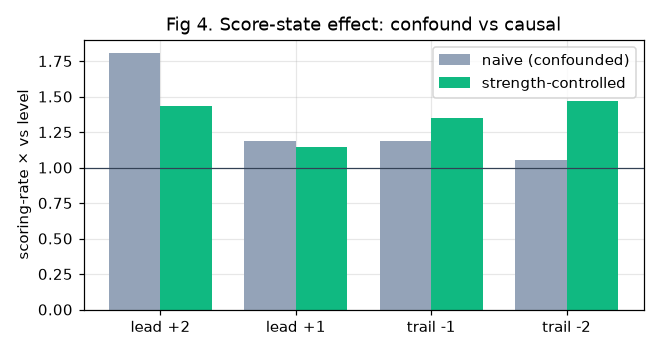

Naively, leading teams *appear* to score more (×1.19 at +1) — but that is
selection (strong teams lead). The strength-controlled GLM (Alg. 4) shows the
textbook "leading team eases off ×0.88" is **not supported** (lead +1 ×1.15,
p=0.18), while a **trailing team genuinely pushes** (−1 ×1.35, −2 ×1.47, p<0.01).
The minute simulator now uses the fitted table; the leading side is capped ≤1.0
(residual momentum confound), the trailing push adopted where significant.

### 4.4 Attack/defence λ — the forward-vs-defender matchup

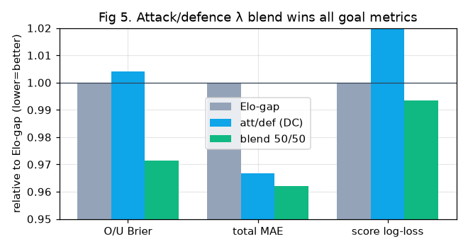

Hypothesis: the single Elo gap can't tell a great-attack/weak-defence team from
a balanced one. The Dixon-Coles att/def ratings express that asymmetry (they
lose to Elo for 1X2, so weight 0 there) — but do they help the *goal* targets?
Hold-out (2,492 recent intl matches):

| λ source | O/U Brier | O/U bias | total MAE | score log-loss |
|---|---|---|---|---|
| Elo-gap | 0.2512 | +0.084 | 1.477 | 2.906 |
| att/def (DC) | 0.2522 | −0.023 | 1.428 | 2.966 |
| **blend 50/50** | **0.2440** | +0.036 | **1.421** | **2.887** |

The blend wins all three goal metrics. **Adopted:** `λ = 0.5·Elo + 0.5·att/def`
(48/48 WC teams covered); 1X2 stays the Elo ensemble.

### 4.5 In-tournament xG-form

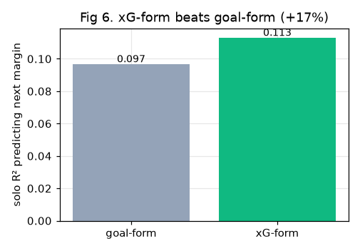

Rolling **xG-form predicts the next result better than goals-form** (3,742 obs:
solo R² 0.113 vs 0.097, +17%; joint coef 0.61 vs 0.20). xG is the less-noisy
strength signal. **Adopted** as a bounded in-tournament Elo nudge: a team
out-performing its scoreline on xG (unlucky) is rated up, an over-performer down
(±25 Elo, decaying n/(n+2)), feeding every goal target and scorecard-audited.

### 4.6 Style factors (shrunk to measured effect)

On 314 matches, controlling for shots, neither possession-balance (p=0.29) nor
pressing (p=0.38) adds to total goals; possession dominance barely predicts wins
(r=0.05). The style λ-multiplier was halved (`style_total_max` 0.06→0.03) and the
style→W/D/L supremacy cap cut (±18→±10 Elo) — kept small, audited live.

### 4.7 Pre-match shot-form (recent shot-volume differential)

The in-tournament xG-form (§4.5) is empty before a team has played; the WC-2026
**pre-match** product needs a recent-form signal from outside the tournament.
We back-filled recent internationals (qualifiers, Nations League, friendlies,
finals) from two open sources and tested whether rolling shot-volume form adds to
a strength + goal-form baseline.

A first single-split test read *null* — but that was a false-null from
over-parameterisation (14 event features on 383 matches). With a parsimonious
3-feature diff set and a 4-fold time-series CV, recent **shot-volume differential
improves OUTCOME** robustly: RPS −0.007 on the holdout *and* −0.007 across 4/4 CV
folds (ESPN, 808 matches), independently corroborated on a second corpus
(Sofascore, 432 matches: RPS −0.016). The effect is shots > shots-on-target ≫
possession; it does **not** help totals (flat MAE). **Adopted** as a bounded Elo
offset (`shot_form_delta`): per-team `clip(elo_per_unit·(form−mean), ±20)·n/(n+2)`,
with `elo_per_unit` set by the data spread (±2σ→±cap) rather than the inflated
crude-Elo partial slope (p<1e-4) — direction validated, magnitude bounded,
scorecard-audited. Coverage 44/48 teams; coefficient/table regenerate from
`ml.espn_backfill` + `ml.shot_form_fit`. Source is **free** (ESPN); see §5 for why
the paid xG/box-entry alternatives were rejected.

---

## 5. Negative results (tested, rejected)

A research record is incomplete without the "no"s. Each was measured, not
assumed:

| Hypothesis | Test | Verdict |
|---|---|---|
| Graph / passing-network style embedding | leave-one-tournament-out CV | RPS 0.2376→0.2381 (worse) — no gain beyond strength |
| Tactical counter-matchup amplifies corners | wide-attack × opp-concede interaction | coef −0.0037 (sub-additive), not amplifying |
| Rest / fixture congestion → goals/result | 1,820 matches, strength-controlled | p=0.15 / 0.86 — no effect |
| shots-in-box (shotmap) proxy for box entries | 5,232-match GLM | +AIC 22 vs box-entry's 817 — negligible |
| Style/tactics → 1X2 beyond strength | §4.6 | weak, shrunk not added |
| Player cohesion / "found out" / solo breakthrough | — | not validatable (no labels); variance, not signal |
| Real xG-form (paid) beats free shot-form for 1X2 | Sofascore corpus, 432 matches, holdout+CV | shots ≥ xG (+both ≈ +shots) — paid xG **not worth it** |
| Box-entries / big-chances / xG → totals | same corpus, Poisson MAE | all worse on CV — null |
| Final-third entries → corners | same corpus | looked +0.13 MAE at n=56 but **flipped to worse at n=183** — small-sample artifact, null |

The only genuinely useful graph — the team-result network — is already exploited
by Elo/pi-rating propagation. The shot-form result (§4.7) and the three rows above
came from a deliberate data-source study: the **free** ESPN proxy is sufficient; no
RapidAPI-paid event feature (real xG, big chances, final-third entries) beat it, so
the paid quota is reserved rather than spent on serving null features.

---

## 6. Self-correction loop

- **Pre-match snapshots** store, before kickoff, the prediction *and* per-factor
  counterfactuals ("the O/U / W-D-L *without* factor X").
- **Factor scorecard** grades each bounded factor with/without on the actual
  result (Brier for O/U factors, RPS for Elo factors) → helping / hurting /
  neutral. Hurting factors are disabled by an env flag, no code change.
- **Corners** and **sim-timing** scorecards validate corner O/U and scenario
  probabilities (late goal, comeback, result-flips-vs-HT) against outcomes.
- **Adaptive corners base** + **online Elo** + **nightly retrain** keep the model
  current; fitted JSON artifacts make re-fits hot-swappable.

---

## 7. Limitations

- WC-2026 lacks event-level data (LiveScore has no passing network), so
  event-derived features (box entries) inform but cannot serve live.
- Venue altitude/heat and situational context (dead rubber, biscotto) lack a
  clean labelled dataset → kept as bounded literature priors, audited live.
- Outcome predictability is intrinsically capped by variance; gains are modest
  by nature, which is why every claim is hold-out-validated.

We deliberately **do not fabricate** coefficients where data can't support them.

---

## 8. Reproducibility

```bash
cd backend
python -m ml.train                # WDL + O/U + BTTS ensemble (49k+9k)
python -m ml.statsbomb_dataset    # enriched 5,232-match event dataset
python -m ml.statsbomb_fit        # corner determinants + crosses→corner
python -m ml.corner_tactics_fit   # B2/B3 tactical corner + counter-matchup
python -m ml.statsbomb_style_fit  # style → totals / results
python -m ml.statsbomb_sim_fit    # strength-controlled score-state
python -m ml.attdef_lambda_proto  # attack/defence λ vs Elo-gap
python -m ml.xgform_proto         # xG-form vs goal-form
python -m ml.fatigue_proto        # rest/fatigue (null)
python -m ml.squad_strength       # squad prior (Wikipedia × ClubElo)
python -m ml.espn_backfill        # free ESPN intl corpus (recent shot-form)
python -m ml.recent_form_proto    # §4.7 shot-form vs strength (holdout+CV)
python -m ml.shot_form_fit        # ground shot-form Elo coef + team table
python -m ml.sofa_backfill        # Sofascore corpus (xG/box/corners) — RapidAPI
python -m ml.sofa_form_proto      # §5 xG/box/corner premium features (null)
python -m ml.make_figures         # regenerate the figures in this paper
```

RapidAPI keys (`RAPIDAPI_KEY*`) and the data cache live outside git (`.env`,
`backend/ml/data/`); `ml.rapid_client` caches every call to disk and rotates keys
on quota exhaustion. The ESPN path needs no key.

Artifacts: `backend/app/data/models/*_fit.json`. StatsBomb data used under their
licence — attribution: StatsBomb. All predictions are statistical estimates for
research/reference — not betting advice.

---

## 9. TODO — validation pass after group-stage round 1

Every bounded factor was adopted with a hold-out-validated *direction* but is
graded LIVE. **After matchday 1 of all 12 groups** (~24 real matches), re-read
the scorecards and keep / disable / re-fit each:

- [ ] Factor scorecard verdicts: `style`, `context`, `venue`, `prior`,
      `style_sup`, `xg_form`, `shot_form` → disable any "hurting" (n≥~10) via its env flag.
- [ ] Refresh shot-form table (`ml.espn_backfill --months 3` + `ml.shot_form_fit`)
      so WC-2026 results enter the rolling window; re-check `shot_form` verdict.
- [ ] Corners scorecard + adaptive base (9.07 → observed).
- [ ] sim-timing scorecard (ht_flip / late-goal / comeback / clean-sheet).
- [ ] meta-weights (W/D/L blend; active ≥8 finished).
- [ ] O/U + handicap calibration on round-1 results (`ou_total_scale`,
      `goal_dc_weight`).
- [ ] xG-form nudge verdict (`xg_form_elo`, `xg_form_cap`).

Not yet built: §2C derived markets (clean-sheet, win-to-nil, odd/even, HT/FT,
first/next goal) — free from the reconciled matrix/sim, zero accuracy risk.


---

## References

1. M. J. Dixon, S. G. Coles (1997). *Modelling Association Football Scores and Inefficiencies in the Football Betting Market.* Journal of the Royal Statistical Society C, 46(2).
2. M. J. Maher (1982). *Modelling association football scores.* Statistica Neerlandica, 36(3).
3. A. E. Elo (1978). *The Rating of Chessplayers, Past and Present.* Arco. (logistic rating update)
4. A. C. Constantinou, N. E. Fenton (2013). *Determining the level of ability of football teams by dynamic ratings (pi-ratings).* Journal of Quantitative Analysis in Sports, 9(1).
5. T. Chen, C. Guestrin (2016). *XGBoost: A Scalable Tree Boosting System.* KDD.
6. B. Zadrozny, C. Elkan (2002). *Transforming classifier scores into accurate multiclass probability estimates (isotonic calibration).* KDD.
7. E. S. Epstein (1969). *A Scoring System for Probability Forecasts of Ranked Categories (RPS).* J. Applied Meteorology, 8(6).
8. I. Csiszár (1975). *I-divergence geometry of probability distributions and minimization problems.* Annals of Probability, 3(1).
9. W. E. Deming, F. F. Stephan (1940). *On a least squares adjustment of a sampled frequency table (IPF).* Annals of Mathematical Statistics, 11(4).
10. R. Sinkhorn (1967). *Diagonal equivalence to matrices with prescribed row and column sums.* American Mathematical Monthly, 74(4).
11. M. Dixon, M. Robinson (1998). *A birth process model for association football matches.* The Statistician, 47(3).
12. L. M. Hvattum, H. Arntzen (2010). *Using ELO ratings for match result prediction in association football.* International Journal of Forecasting, 26(3).
13. StatsBomb Open Data — github.com/statsbomb/open-data (event data; used under StatsBomb's licence, with attribution).

---

## Appendix A — Glossary (terms & metrics)

**Elo** — a relative team-strength rating updated after each match: beat a
stronger side and you gain more points than beating a weaker one. ~1500 is
average; WC contenders sit ~1900–2150. A ~190-Elo gap ≈ one expected goal of
supremacy here. Used as the backbone strength signal.

**xG (expected goals)** — the number of goals an *average* finish would yield
from the chances created, summing each shot's scoring probability by its
location/type. A team with xG 2.1 "deserved" ~2 goals regardless of the actual
score. Less noisy than goals → a better strength signal (§4.5).

**λ (lambda)** — a team's expected goals *in this match* (the Poisson mean).
The whole engine converts strength → λ_home, λ_away, then a goal distribution.

**Poisson distribution** — the standard count model for goals: given mean λ,
it gives P(0), P(1), P(2)… goals. Two independent Poissons give a score grid.

**Dixon-Coles** — a bivariate-Poisson refinement that (a) corrects the
correlation of low scores (0-0, 1-1) via parameter **ρ (rho)**, and (b) rates
each team by separate **attack (att)** and **defence (def)** strengths rather
than one number (§4.4).

**pi-rating** — an alternative rolling rating from goal differences; a secondary
strength feature in the ensemble.

**O/U (Over/Under)** — a goals (or corners) total line, e.g. "Over 2.5": will
the match have ≥3? **Asian line** — the same at non-integer/quarter lines
(2.25, 2.75) where a quarter-line splits the stake.

**Asian handicap (kèo chấp)** — a goal head-start: "home −1.5" wins only if home
wins by 2+. Read from the score matrix as P(margin + line > 0).

**BTTS** — Both Teams To Score (yes/no).

**IPF (iterative proportional fitting)** — the algorithm (Alg. 1) that nudges
the score matrix the least amount needed to match target marginals, so all
markets stay consistent.

**GLM / Poisson regression** — a regression for count outcomes (e.g. corners);
its coefficients say how each feature shifts the expected count. **offset** — a
fixed known term in a GLM (here log team-xG) used to *control for* strength.

**Hold-out** — matches set aside from training, used to test honestly.
**Leave-one-tournament-out** — train on all tournaments but one, test on the
held-out one (no leakage).

**RPS (Ranked Probability Score)** — error metric for ordered outcomes (W/D/L);
lower is better (ours 0.1605). **Brier score** — squared error for a yes/no
probability (O/U, BTTS); lower is better. **log-loss** — penalises confident
wrong probabilities; used for exact-score. **MAE** — mean absolute error (e.g.
predicted vs actual total goals). **ECE** — Expected Calibration Error: average
gap between predicted probability and observed frequency.

**Calibration / reliability** — does "60%" happen ~60% of the time? A reliability
diagram plots predicted vs observed; the diagonal is perfect (Fig 3).
**Isotonic calibration** — a monotone map that corrects miscalibrated
probabilities.

**Over-dispersion (Var/Mean > 1)** — real goal counts spread wider than a single
Poisson predicts (fatter 0–1 and 7+ tails, Fig 2).

**Confound / strength-controlled** — a spurious association from a lurking
variable (strong teams both lead *and* score); we remove it with a control
(Alg. 4, §4.3).

**Bounded prior** — a small, capped adjustment whose direction comes from theory
but whose size is limited and audited, so it can't dominate the data.

---

## Appendix B — Mathematical notation

| Symbol | Meaning |
|---|---|
| λ_h, λ_a | expected goals (Poisson mean) for home / away this match |
| Δelo | effective Elo difference (home + home-adv + priors − away) |
| a, b | fitted goal-rate coefficients: `λ = exp(a ± b·Δelo/100)` |
| att_x, def_x | Dixon-Coles attack / defence rating of team x |
| c, adv | Dixon-Coles intercept / home-advantage term |
| ρ (rho) | Dixon-Coles low-score correlation (≈ −0.06) |
| w | blend weight of att/def into λ (`goal_dc_weight`, 0.5) |
| M | the reconciled score matrix M[h,a] = P(home h, away a) |
| n, k | matches played; shrink constant in `n/(n+k)` |
| δ | a bounded Elo offset (prior); `clip(scale·signal, ±cap)·n/(n+k)` |
| r | Pearson correlation coefficient |
| p | statistical p-value (significant if < 0.05) |
| R² | variance explained by a regression |

---

## Appendix C — Tunable parameters (env-overridable)

All are serving knobs (no retrain needed); values are the current defaults.

| Parameter | Value | Controls |
|---|---|---|
| `goal_dc_weight` | 0.5 | att/def share of the goal λ (§4.4) |
| `ou_head_weight` / `btts_head_weight` | 0.95 / 0.9 | trust the calibrated O/U head over the raw matrix (§4.2) |
| `ou_total_scale` | 0.94 | total-goals scale of the Asian-line matrix (§4.2) |
| `corners_base` | 9.07 | intl mean total corners, then adaptive |
| `corners_cross_to_corner` | 0.389 | fitted crosses→corner ratio (§4.1) |
| `corners_adapt_k` | 20 | how slowly the corner base tracks observed WC corners |
| `xg_form_elo` / `xg_form_cap` / `xg_form_k` | 40 / 25 / 2 | in-tournament xG-form Elo nudge (§4.5) |
| `shot_form_enabled` | true | pre-match shot-form Elo nudge (§4.7); coef/cap in `shot_form.json` |
| `style_total_max` | 0.03 | max style effect on total goals (§4.6) |
| `style_sup_max_elo` | 10 | max style→W/D/L Elo nudge (§4.6) |
| `sim_state_effect` | (table) | minute-sim score-state response (§4.3, from sim_fit.json) |
| `*_enabled` flags | true | per-factor on/off for the live-audit kill-switch (§6) |

